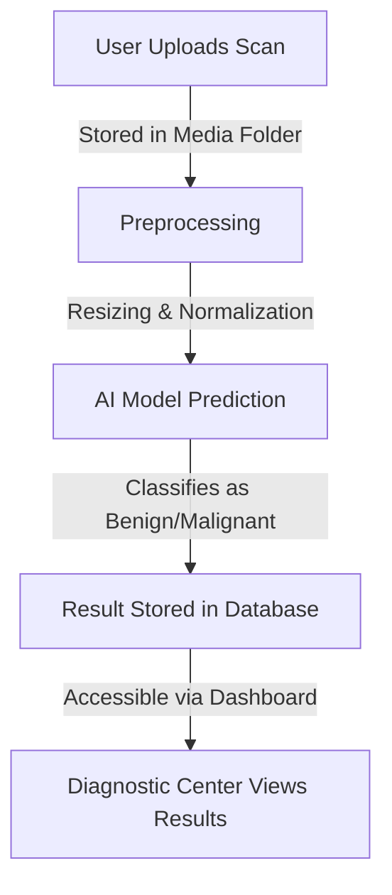

# Breast Cancer Detection System


## 📌 Overview
The **Breast Cancer Detection System** is an AI-powered web application designed to assist diagnostic centers in analyzing and detecting breast cancer from medical scans. The system streamlines the workflow by allowing diagnostic centers to upload patient scans, which are processed using a deep learning model to predict whether a scan is **benign** or **malignant**.

## 🎯 Features
- **User Authentication**: Secure login for diagnostic centers and patients.
- **Scan Upload**: Diagnostic centers can upload medical scans for analysis.
- **AI-Based Prediction**: Utilizes a trained deep learning model for classification.
- **Report Generation**: Generates detailed scan reports for review.
- **Patient Record Management**: Store and retrieve patient scan history.
- **Intuitive UI**: User-friendly interface with easy navigation.

## 🏛 Project Structure
```plaintext
📁 breast_cancer_detection
│── manage.py               # Django management script
│── .env                    # Environment variables
│── .gitignore              # Git ignored files
│
├───breast_cancer_detection # Main Django application
│   ├── settings.py         # Application settings
│   ├── urls.py             # URL configurations
│   ├── wsgi.py             # WSGI configuration
│
├───diagnostics             # Breast cancer detection logic
│   ├── models.py           # Database models
│   ├── views.py            # Business logic & API endpoints
│   ├── inference.py        # AI inference logic
│   ├── templates/          # HTML templates
│   ├── static/             # Static files (CSS, JS, images)
│
├───users                   # User authentication & profile management
│   ├── models.py           # User models
│   ├── views.py            # Authentication logic
│   ├── templates/          # User-related HTML templates
│
├───media                   # Uploaded scan images
│
└───Scans                   # Sample scan images
    ├── benign/
    ├── malignant/
    └── no_cancer/
```

## 🏗 System Architecture


## 📊 Result Parameters
Each scan analysis generates a report containing:
- **Prediction:** Benign / Malignant
- **Confidence Score:** Probability of the classification
- **Report PDF:** A downloadable report for patient records

## ⚙️ Tech Stack
- **Frontend**: HTML, CSS, JavaScript
- **Backend**: Django, Python
- **Database**: SQLite
- **Machine Learning**: TensorFlow Lite
- **Storage**: Django Media Files

## 🚀 Getting Started
### 1️⃣ Clone the Repository
```bash
git clone https://github.com/yourusername/breast_cancer_detection.git
cd breast_cancer_detection
```

### 2️⃣ Set Up Virtual Environment
```bash
python -m venv venv
source venv/bin/activate   # On macOS/Linux
venv\Scripts\activate      # On Windows
```

### 3️⃣ Install Dependencies
```bash
pip install -r requirements.txt
```

### 4️⃣ Run Migrations
```bash
python manage.py migrate
```

### 5️⃣ Start the Server
```bash
python manage.py runserver
```

## 📜 License
This project is licensed under the **MIT License**.

## 🤝 Contributing
Contributions are welcome! Feel free to fork this repository, create a feature branch, and submit a pull request.

## 📞 Contact
For any queries, reach out via email at **itsca03@gmail.com** or connect on [LinkedIn](https://www.linkedin.com/in/chaitra-adiga-1430ba295/).

